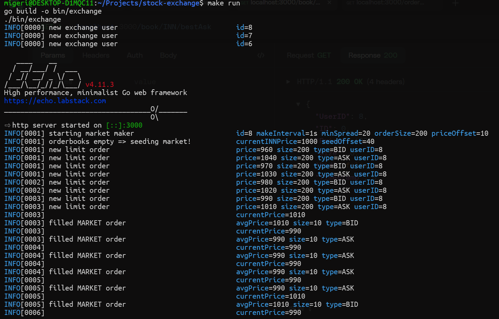
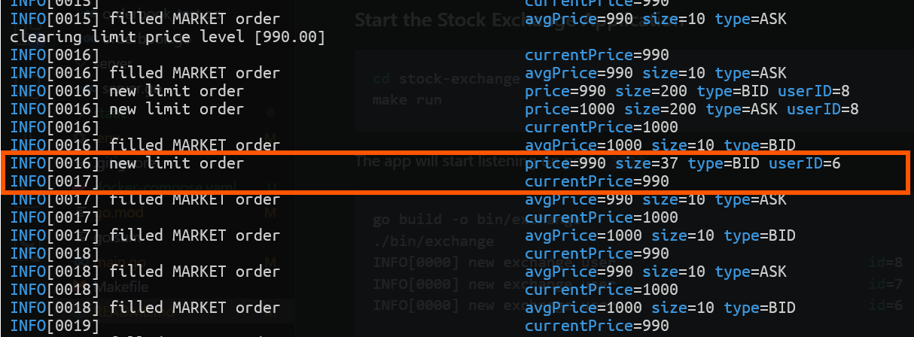

# stock-exchange

An exchange with a working matching engine, orderbooks and market maker.

---

### How to Start application

Clone the application using the below command

```bash
git clone git@github.com:bruce-mig/stock-exchange.git
```

### Start ganache sandbox server

Ensure docker is running then run

```bash
cd stock-exchange\
docker compose up
```

Ganache server will provide wallets to the users so they can trade on the exchange.  
Ganache server will be listening on port `:8545`

### Test the Stock Exchange Application

```bash
cd stock-exchange
make test
```

### Start the Stock Exchange Application

First create a `.env` file at the root of the project with the following keys:
```bash
# retrieve the private keys from the ganache server logs
EXCHANGE_PK="" # exchange private key
USER_1_PK="" # user private key
USER_2_PK="" # user private key
USER_3_PK="" # user private key

SERVER_ENDPOINT="http://localhost:3000"
CSD_ENDPOINT="http://localhost:8545"
```

Then start the application with the following command

```bash
cd stock-exchange
make run
```

The app will start listening on port `:3000`

```bash
go build -o bin/exchange
./bin/exchange
INFO[0000] new exchange user                             id=8
INFO[0000] new exchange user                             id=7
INFO[0000] new exchange user                             id=6

   ____    __
  / __/___/ /  ___
 / _// __/ _ \/ _ \
/___/\__/_//_/\___/ v4.11.3
High performance, minimalist Go web framework
https://echo.labstack.com
____________________________________O/_______
                                    O\
⇨ http server started on [::]:3000
INFO[0001] starting market maker                         id=8 makeInterval=1s minSpread=20 orderSize=200 priceOffset=10
INFO[0001] orderbooks empty => seeding market!           currentINNPrice=1000 seedOffset=40
INFO[0001] new limit order                               price=960 size=200 type=BID userID=8
INFO[0001] new limit order                               price=1040 size=200 type=ASK userID=8
INFO[0001] new limit order                               price=970 size=200 type=BID userID=8
INFO[0001] new limit order                               price=1030 size=200 type=ASK userID=8
INFO[0002] new limit order                               price=980 size=200 type=BID userID=8
INFO[0002] new limit order                               price=1020 size=200 type=ASK userID=8
INFO[0003]                                               currentPrice=980
INFO[0003] filled MARKET order                           avgPrice=980 size=10 type=ASK
INFO[0003] new limit order                               price=990 size=200 type=BID userID=8
INFO[0003] new limit order                               price=1010 size=200 type=ASK userID=8
INFO[0003]                                               currentPrice=990
INFO[0003] filled MARKET order                           avgPrice=990 size=10 type=ASK
INFO[0004]                                               currentPrice=1010
INFO[0004] filled MARKET order                           avgPrice=1010 size=10 type=BID
INFO[0004]                                               currentPrice=990
INFO[0004] filled MARKET order                           avgPrice=990 size=10 type=ASK
INFO[0005]                                               currentPrice=990
```




---

## APIs

#### Place Limit Order 

```bash
migeri@DESKTOP-D1MQC11:~/Projects/stock-exchange$ http POST localhost:3000/order \
   UserID:=6 \
   Type=LIMIT \
   Bid:=true \
   Price:=990 \
   Size:=37 \
   Market=INN
```
Below is the success response with the order Id.

```bash
HTTP/1.1 200 OK
Content-Length: 21
Content-Type: application/json; charset=UTF-8
Date: Mon, 18 Nov 2024 15:31:20 GMT

{
    "OrderID": 60464691
}

```

 Below we can see the order was placed successfully:

 

#### Get all user's orders

```bash
migeri@DESKTOP-D1MQC11:~$ http :3000/order/user/6
HTTP/1.1 200 OK
Content-Length: 205
Content-Type: application/json; charset=UTF-8
Date: Mon, 18 Nov 2024 14:59:52 GMT

{
    "Asks": [],
    "Bids": [
        {
            "Bid": true,
            "ID": 47996242,
            "Price": 990,
            "Size": 37,
            "Timestamp": 1731941984832909182,
            "UserID": 6
        },
        {
            "Bid": true,
            "ID": 64503204,
            "Price": 990,
            "Size": 37,
            "Timestamp": 1731941985561347132,
            "UserID": 6
        }
    ]
}
```

#### Get Best Ask for a counter

```bash
migeri@DESKTOP-D1MQC11:~$ http :3000/book/INN/bestAsk
HTTP/1.1 200 OK
Content-Length: 67
Content-Type: application/json; charset=UTF-8
Date: Mon, 18 Nov 2024 15:00:36 GMT

{
    "Bid": false,
    "ID": 0,
    "Price": 990,
    "Size": 0,
    "Timestamp": 0,
    "UserID": 8
}
```

#### Get Best Bid for a counter

```bash
migeri@DESKTOP-D1MQC11:~$ http :3000/book/INN/bestBid
HTTP/1.1 200 OK
Content-Length: 67
Content-Type: application/json; charset=UTF-8
Date: Mon, 18 Nov 2024 15:01:03 GMT

{
    "Bid": false,
    "ID": 0,
    "Price": 970,
    "Size": 0,
    "Timestamp": 0,
    "UserID": 8
}
```

####  Get all trades from counter INN

```bash
migeri@DESKTOP-D1MQC11:~$ http :3000/trades/INN
HTTP/1.1 200 OK
Content-Length: 1362
Content-Type: application/json; charset=UTF-8
Date: Mon, 18 Nov 2024 15:02:17 GMT

[
    {
        "Bid": false,
        "Price": 980,
        "Size": 10,
        "Timestamp": 1731942127526835511
    },
    {
        "Bid": false,
        "Price": 990,
        "Size": 10,
        "Timestamp": 1731942128027074145
    },
    {
        "Bid": true,
        "Price": 1010,
        "Size": 10,
        "Timestamp": 1731942128526714030
    },
    {
        "Bid": false,
        "Price": 990,
        "Size": 10,
        "Timestamp": 1731942129027916243
    },
    {
        "Bid": false,
        "Price": 990,
        "Size": 10,
        "Timestamp": 1731942129526623452
    },
    {
        "Bid": true,
        "Price": 1010,
        "Size": 10,
        "Timestamp": 1731942130024043735
    }
]
```